# Eye-tracking architecture

This document describes how experiment inputs become named gaze targets, how Tobii Pro samples enter the Unity application, and how classified samples are written to XML or optional output adapters.

## End-to-end overview

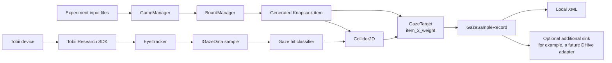

The input side creates and names targets. The Tobii side produces gaze samples. The classifier connects the two.

## 1. Tobii Pro setup and application interface

The Tobii-provided integration is principally under `Assets/TobiiPro`. The custom runtime bootstrap ensures the required services exist before the first Unity scene loads.

### Startup sequence

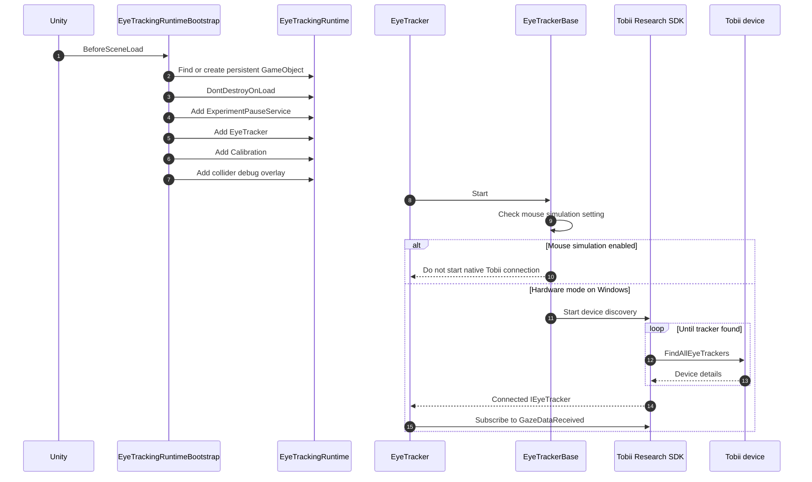

The runtime is created in [`EyeTrackingRuntimeBootstrap.cs`](Assets/EyeTracking/EyeTrackingRuntimeBootstrap.cs). The device lifecycle is implemented in [`EyeTrackerBase.cs`](Assets/TobiiPro/Common/Scripts/EyeTrackerBase.cs) and [`EyeTracker.cs`](Assets/TobiiPro/ScreenBased/Scripts/EyeTracker.cs).

### Gaze-sample sequence

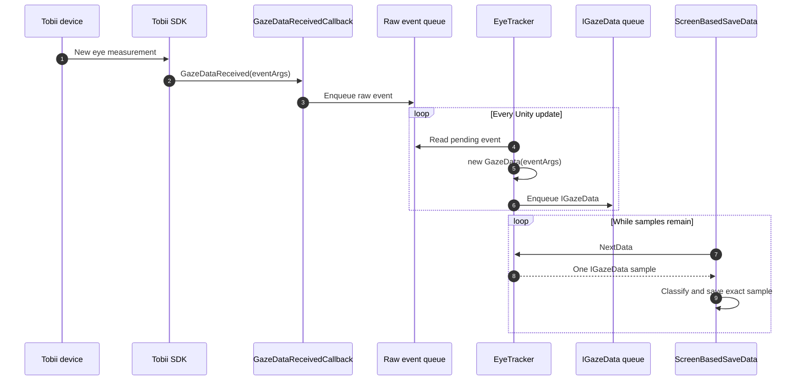

`IGazeData` is the common format understood by the remainder of the application. It carries left-eye and right-eye data, validity flags, normalized display coordinates, the Tobii timestamp, and the original raw event. `MouseGazeData` implements the same interface, so simulated and hardware input use the same classifier and writer.

Calibration is a parallel control path: `Ctrl+Shift+C` pauses task input, runs calibration, records the outcome, and resumes the task. A failed calibration offers **Re-calibrate** and **Ignore and continue**.

## 2. Vendor, adapted, and custom logic

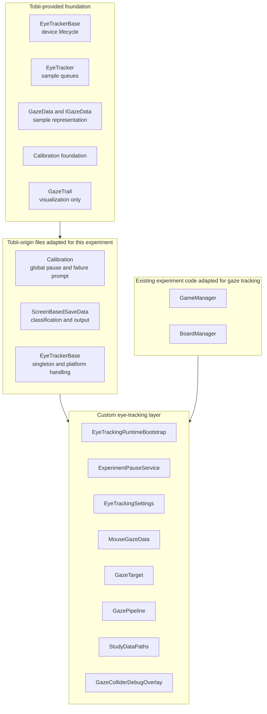

There is no `GazeItem` class in this project. The component is called `GazeTarget`, defined in [`GazeTarget.cs`](Assets/EyeTracking/GazeTarget.cs). It is custom experiment code, not part of the Tobii SDK.

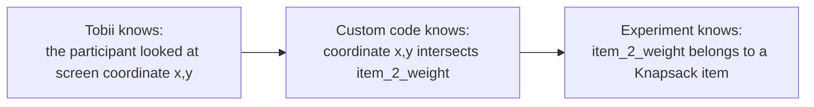

Tobii provides measurements. It cannot infer that a screen region represents a weight, value, answer button, or other experimental area of interest. The application supplies those semantics.

`GazeTrail` is for visualization only. It is not the source of saved target identities.

## 3. Turning an object into a gaze target

A gaze target requires a visible object, physics geometry, and a semantic identity.

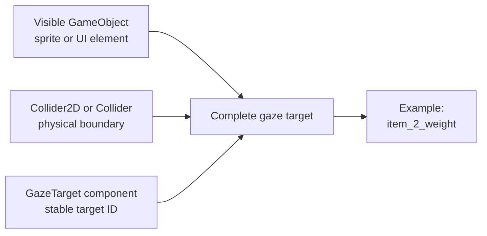

A sprite by itself cannot be hit by a physics ray. A collider can be hit, but it does not explain what the collider means. `GazeTarget` supplies that meaning.

### Target-configuration control flow

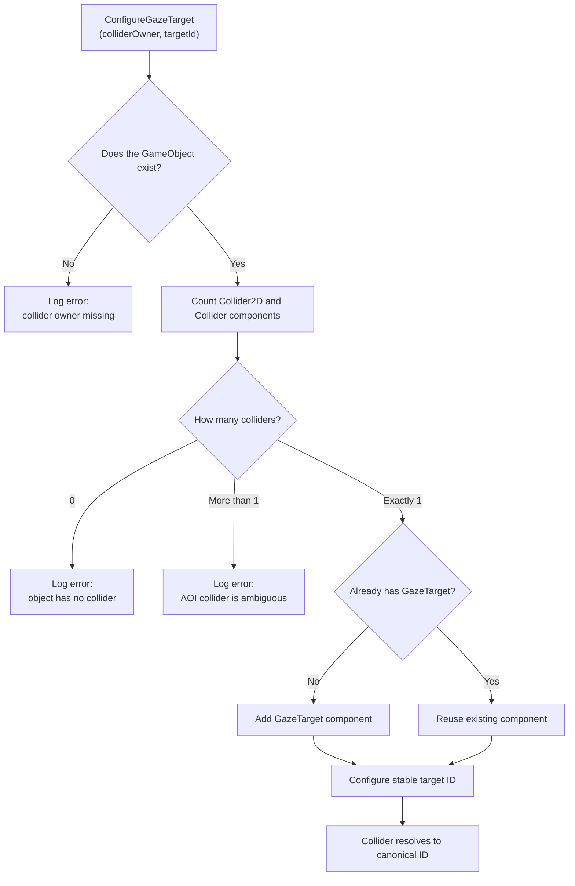

The dynamic configuration helper is in [`BoardManager.cs`](Assets/Scripts/BoardManager.cs). For a static scene object, the equivalent editor workflow is:

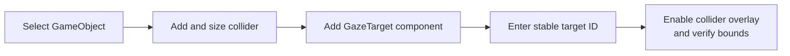

Target IDs should describe stable experimental meaning:

- Good: `item_2_weight`
- Good: `item_2_value`
- Good: `answer_yes`
- Avoid: `Rectangle(Clone)`
- Avoid: `$25`
- Avoid: `MainCanvas/Panel/Image`

Display text and hierarchy names can change. The analysis identity should remain stable.

## 4. Knapsack item naming

Each generated Knapsack item begins with four sibling collider objects in the item prefab.

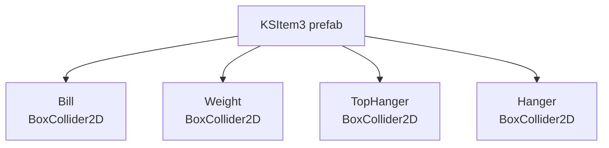

### Generation and naming sequence

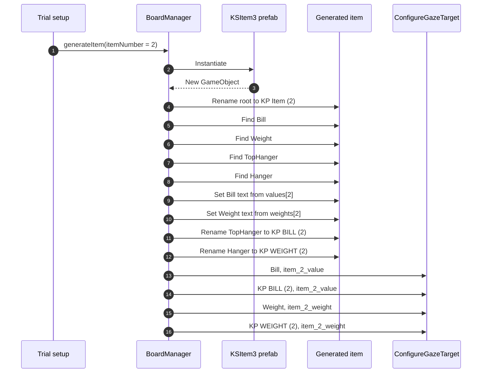

The resulting mapping is:

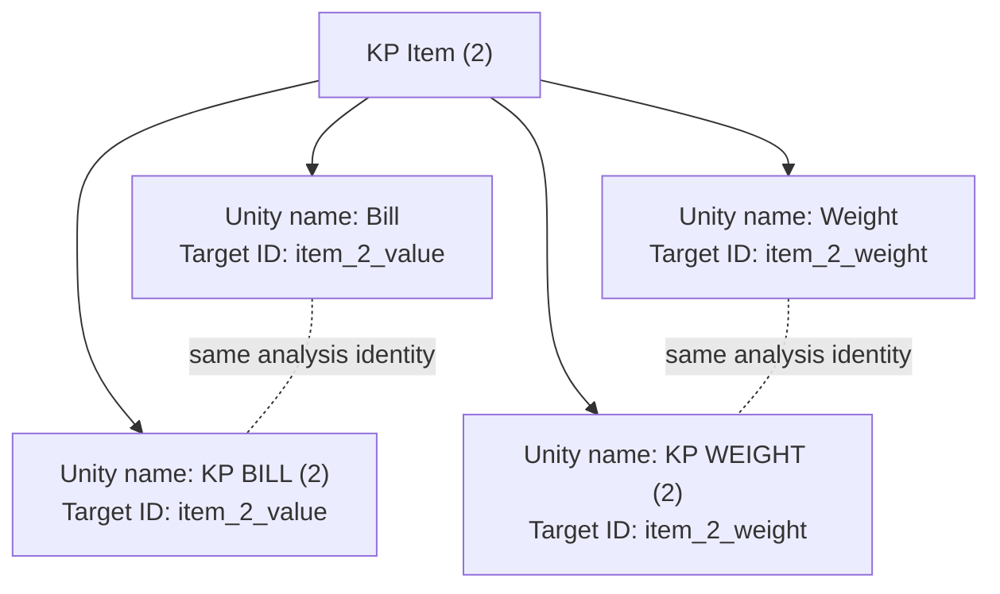

Object names and canonical IDs serve different purposes:

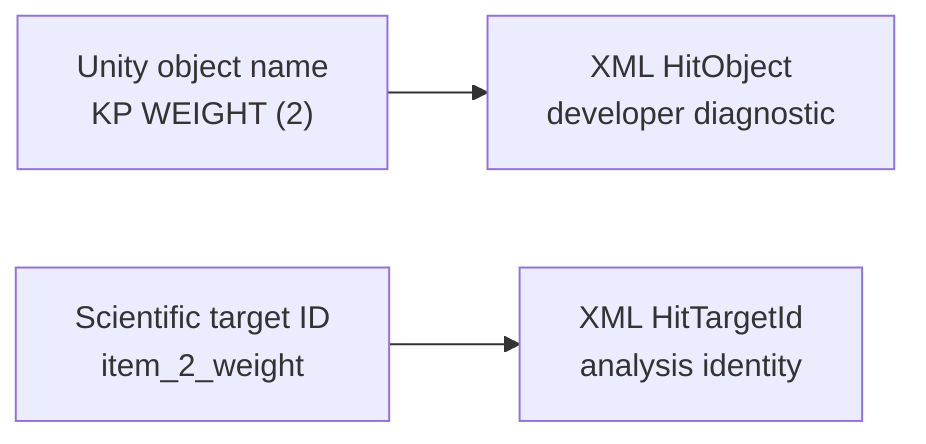

The object name helps developers inspect the Unity hierarchy. The canonical ID is intended for analysis.

The target names are not randomized. `item_2_weight` means item index 2 inside the selected problem arrays. Its screen position can be randomized, but its identity remains `item_2_weight`.

## 5. Gaze classification, data sinks, and output paths

### Hit-classification control flow

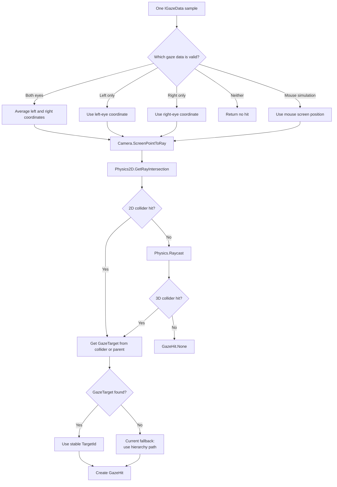

The classifier is defined in [`GazePipeline.cs`](Assets/EyeTracking/GazePipeline.cs).

### Sample-to-sink sequence

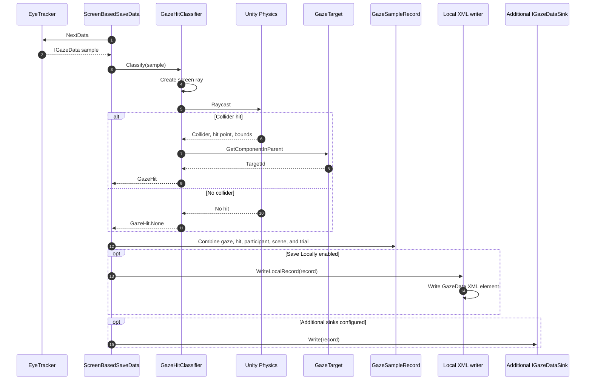

A sink is a destination that consumes the complete record.

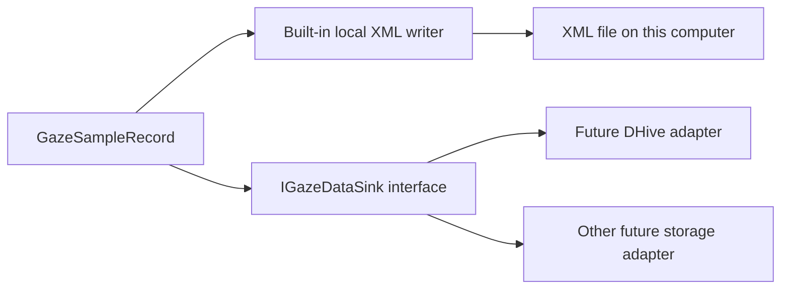

`IGazeDataSink` defines `Write(GazeSampleRecord record)` and `Close()`. No DHive transport is currently implemented; the interface is its extension point.

### XML field lineage

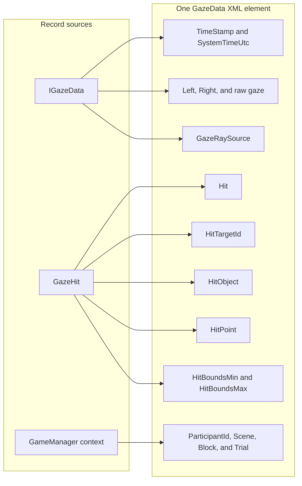

Example mapped hit:

```xml
<GazeData
  Hit="True"
  HitTargetId="item_2_weight"
  HitObject="KP WEIGHT (2)"
  HitPoint="(...)"
  HitBoundsMin="(...)"
  HitBoundsMax="(...)" />
```

`HitTargetId` is the analysis identity. `HitObject` is diagnostic context. XML creation and sink fan-out are handled by [`ScreenBasedSaveData.cs`](Assets/ScreenBasedSaveData.cs).

### Output path

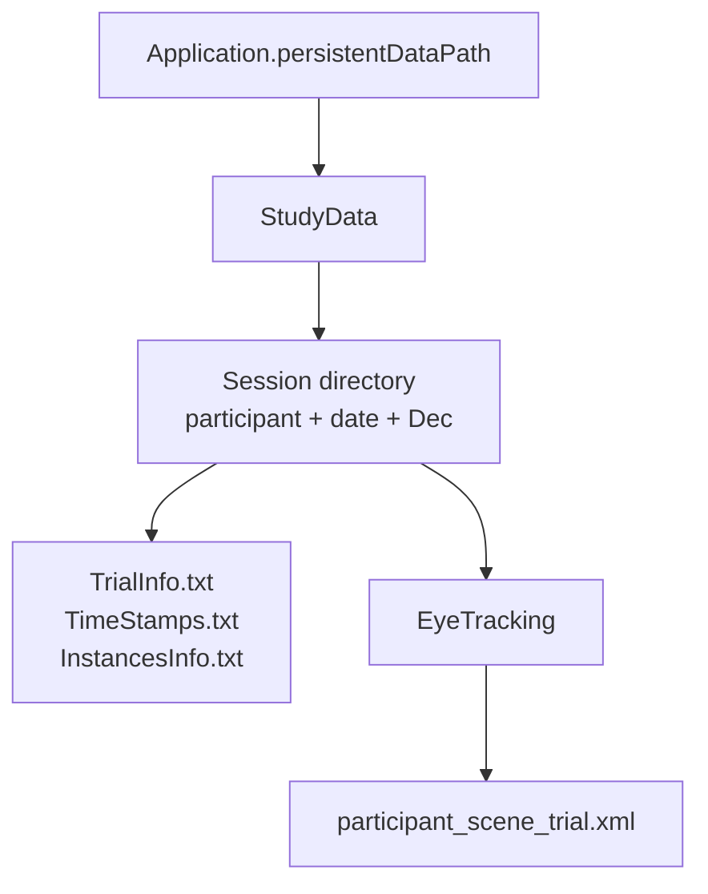

```text
Application.persistentDataPath/
└── StudyData/
    └── <session>/
        ├── TrialInfo.txt
        ├── TimeStamps.txt
        ├── InstancesInfo.txt
        └── EyeTracking/
            └── <identifier>_<scene>_<trial>.xml
```

`Application.persistentDataPath` is selected by Unity and differs by operating system. Path construction is centralized in [`StudyDataPaths.cs`](Assets/EyeTracking/StudyDataPaths.cs). Generated data is no longer written to `Assets/DATAinf/Output`.

## 6. Input loading and randomization

Inputs are read during the `SetUp` scene.

### Input-loading sequence

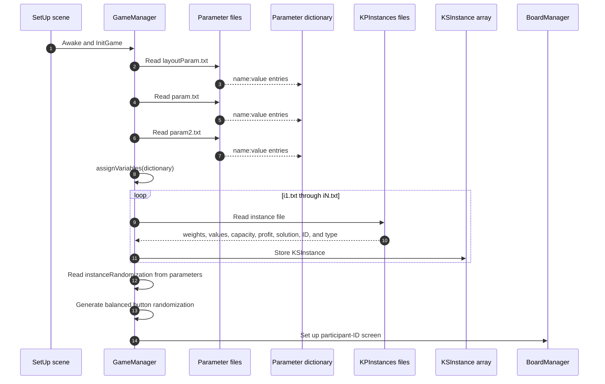

The loaders are in [`GameManager.cs`](Assets/Scripts/GameManager.cs).

### Input structure

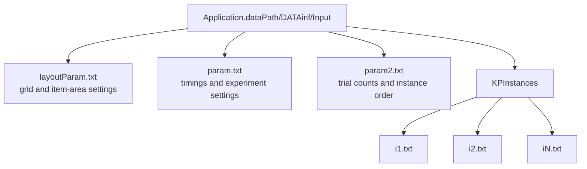

### Instance selection

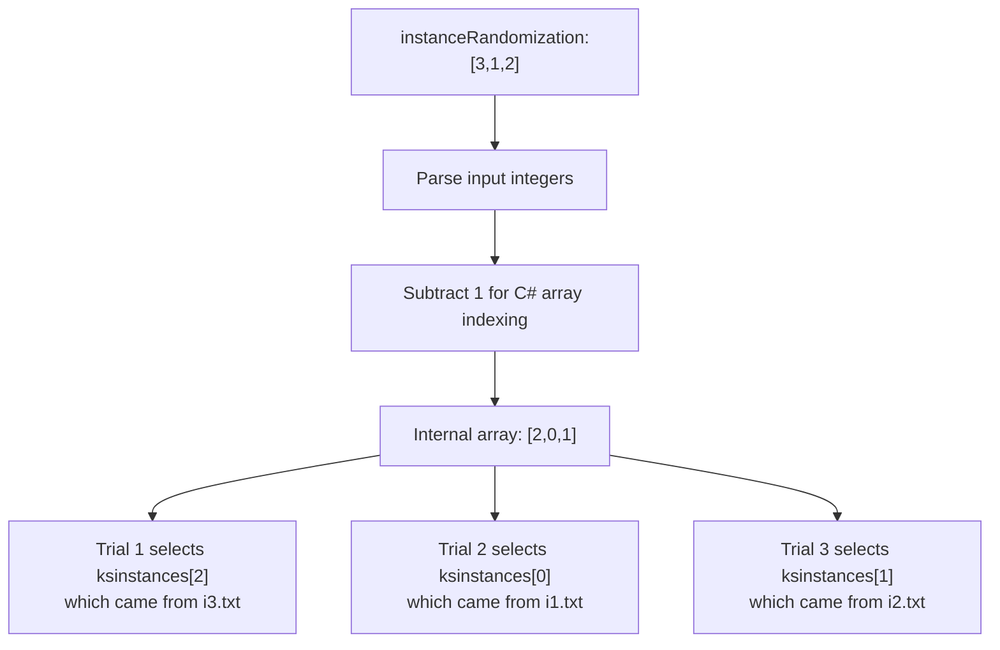

Despite its name, `instanceRandomization` is currently loaded from an input file. The call that would generate it randomly is commented out. The unused generator can also repeat instances, which is noted in the source.

### Runtime randomization

```mermaid
flowchart LR
    Setup["Experiment setup"]

    Setup --> InstanceOrder["Instance order<br/>supplied by param2.txt"]
    Setup --> Buttons["Yes/No sides<br/>balanced and shuffled"]
    Setup --> Positions["Item screen positions<br/>random valid grid cells"]
    Setup --> Rest["Rest duration<br/>random minimum to maximum"]
    Setup --> Likert["Likert starting value<br/>random"]

    InstanceOrder --> NotRuntime["Not currently generated randomly by the app"]
    Buttons --> Runtime["Randomized at runtime"]
    Positions --> Runtime
    Rest --> Runtime
    Likert --> Runtime
```

### From selected input to target names

```mermaid
flowchart TD
    InstanceFile["Selected instance file"]
    Arrays["weights[] and values[]"]
    Loop["BoardManager loops i = 0 to item count - 1"]
    Generate["generateItem(i)"]
    Value["item_i_value"]
    Weight["item_i_weight"]
    Position["RandomPosition()"]

    InstanceFile --> Arrays
    Arrays --> Loop
    Loop --> Generate

    Generate --> Value
    Generate --> Weight
    Generate --> Position

    Position --> Screen["Random location on screen"]
    Value --> Stable["Stable identity"]
    Weight --> Stable
```

The central rule is:

```text
Selected problem → defines the item arrays
Array index      → defines item_N_value and item_N_weight
Random placement → changes only where that named item appears
```

## Current classification limitations

The architecture above documents both the intended design and the current transitional behaviour:

1. A collider without a `GazeTarget` still produces a hierarchy-path fallback in `HitTargetId`.
2. The gaze layer mask currently includes every Unity physics layer.
3. A dedicated `GazeTarget` layer and strict canonical-ID-only output are planned but not yet implemented.
4. The local saver is currently scene-wired rather than part of the persistent runtime in every task-relevant scene.

These limitations should be removed before treating all `HitTargetId` values as canonical experimental identities.
